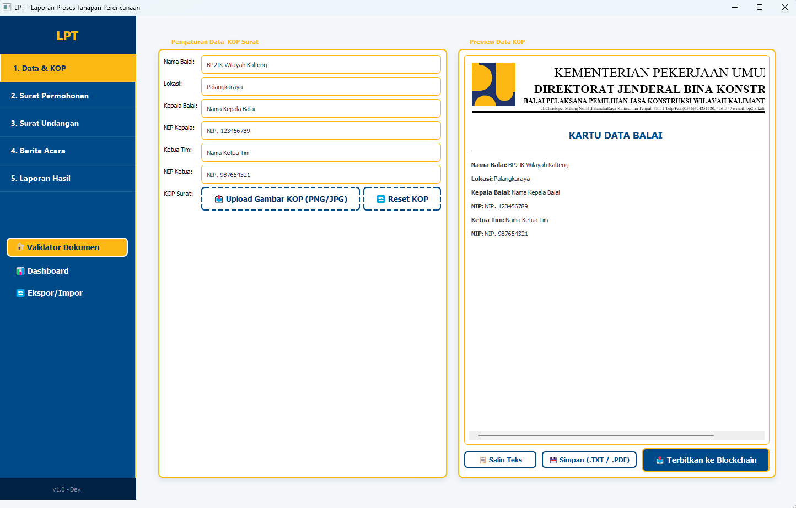
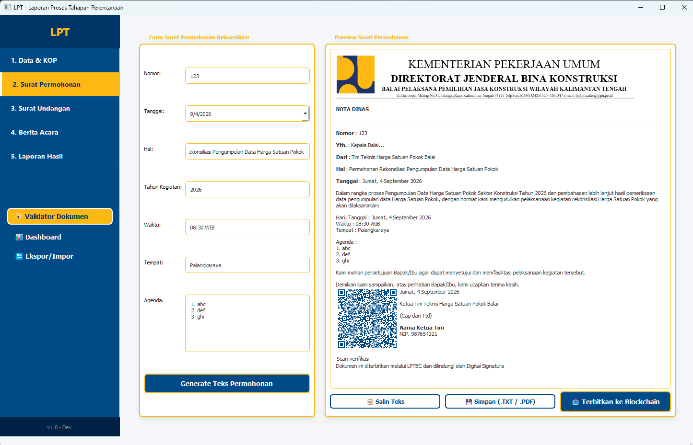
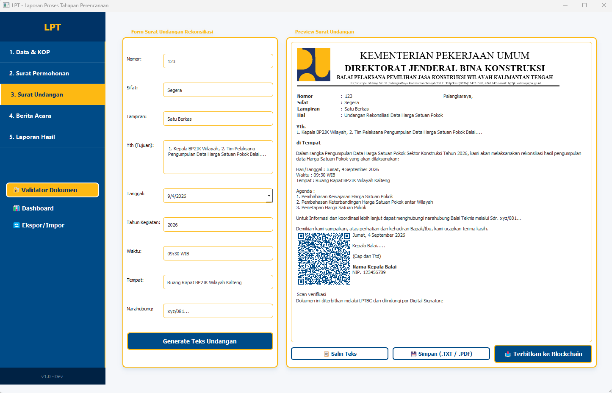
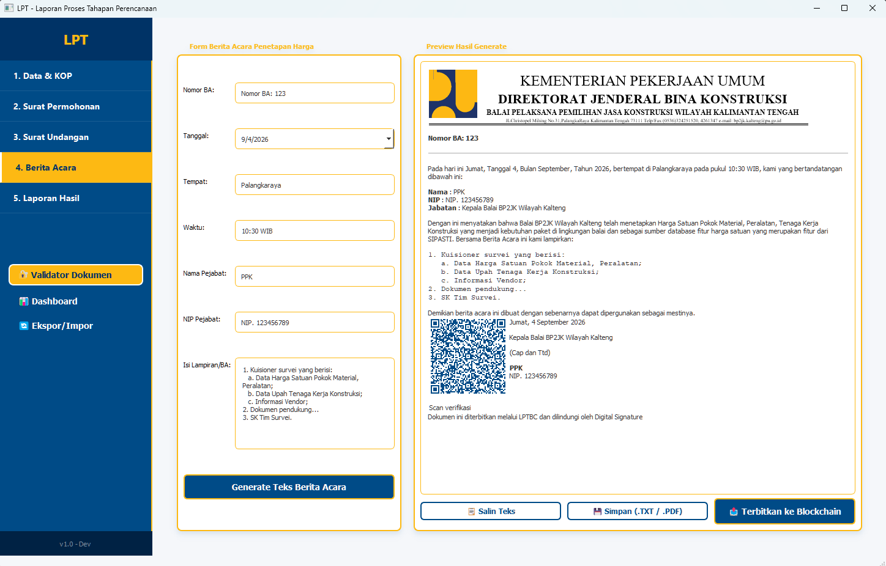
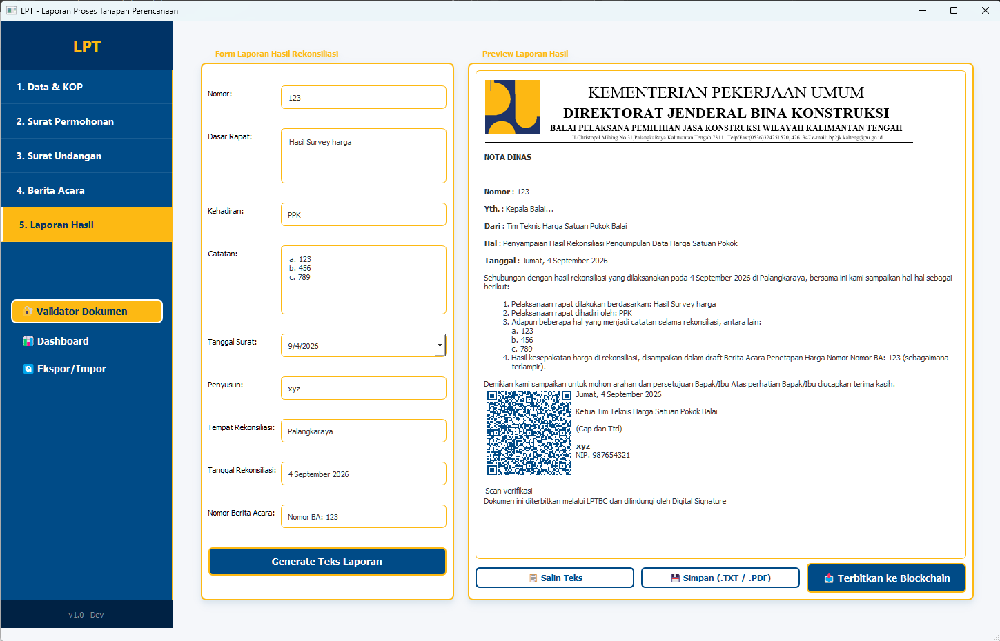
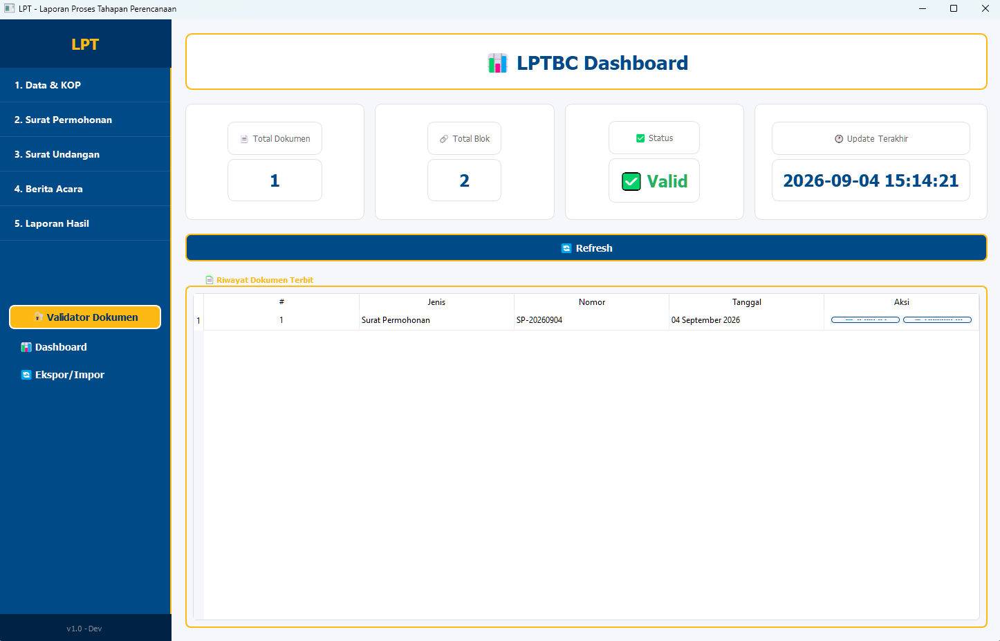
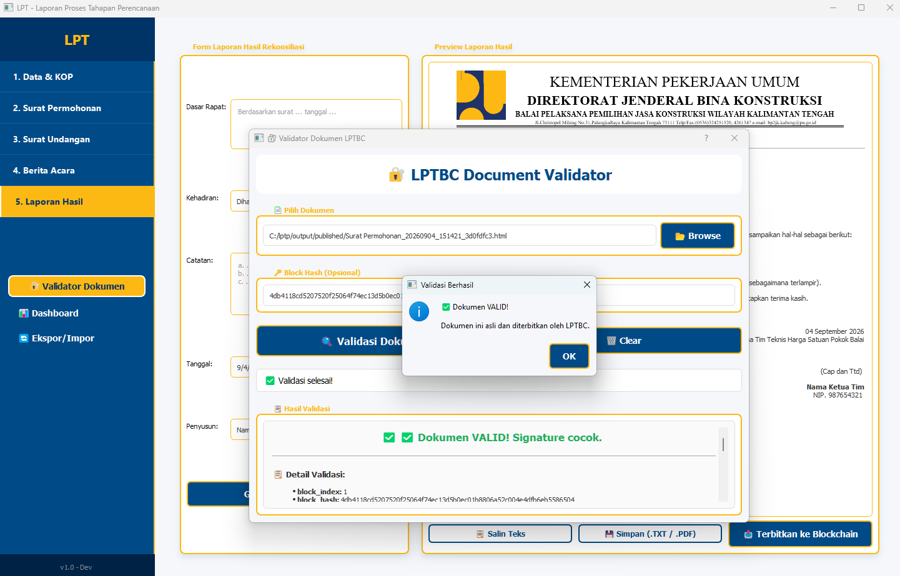
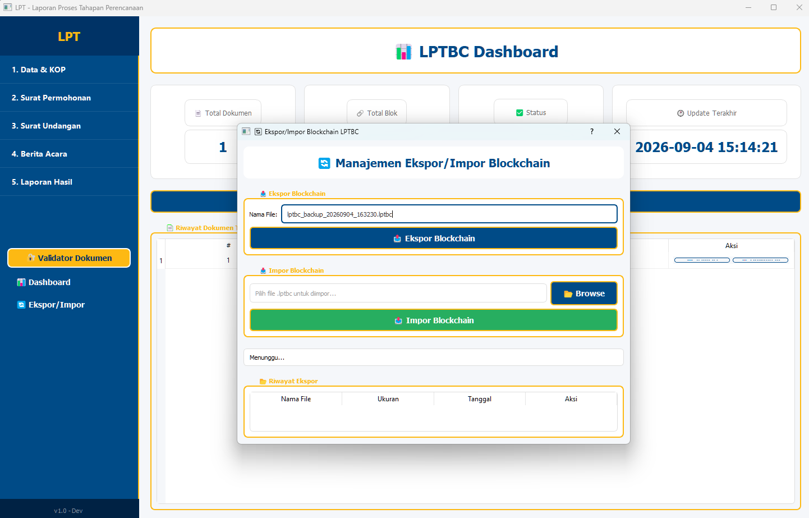

# 🏗️ LPTBC - Laporan Proses Tahapan Perencanaan dengan Blockchain

[](https://www.python.org/)
[](https://riverbankcomputing.com/software/pyqt/)
[](LICENSE)
[](https://github.com/yourusername/lptbc)
[]()
[]()
[]()

---

## 📋 Table of Contents

- [Overview](#-overview)
- [Features](#-features)
- [Technology Stack](#-technology-stack)
- [Installation](#-installation)
- [Usage Guide](#-usage-guide)
  - [1. Data & KOP](#1-data--kop)
  - [2. Surat Permohonan](#2-surat-permohonan)
  - [3. Surat Undangan](#3-surat-undangan)
  - [4. Berita Acara](#4-berita-acara)
  - [5. Laporan Hasil](#5-laporan-hasil)
  - [6. Dashboard](#6-dashboard)
  - [7. Validator Dokumen](#7-validator-dokumen)
  - [8. Ekspor/Impor](#8-eksporimpor)
- [Development](#-development)
- [License](#-license)
- [Contributing](#-contributing)

---

## 📖 Overview

**LPTPBC (LPTP + Blockchain)** adalah aplikasi desktop berbasis GUI (PyQt5) yang dirancang untuk membantu tim teknis dalam mengelola, menginput, dan menghasilkan dokumen resmi terkait **Pengumpulan Data Harga Satuan Pokok Sektor Konstruksi** dengan **fitur blockchain dan digital signature** untuk menjamin keaslian dan integritas dokumen.

### 🎯 **Tujuan Utama:**
1. ✅ Mempermudah pembuatan dokumen resmi (Nota Dinas, Surat Undangan, Berita Acara, Laporan)
2. ✅ Menjamin **keaslian dokumen** dengan Digital Signature
3. ✅ Menyediakan **rekam jejak permanen** melalui Blockchain
4. ✅ Memungkinkan **verifikasi keaslian** dokumen kapan saja
5. ✅ Mendukung **ekspor/impor** blockchain untuk backup dan migrasi

---

## 🚀 Features

### Core Features

| Fitur | Deskripsi | Status |
|-------|-----------|--------|
| 📄 **Dokumen Resmi** | Surat Permohonan, Undangan, Berita Acara, Laporan Hasil | ✅ |
| 🖼️ **Data & KOP** | Input identitas balai, pejabat, upload KOP surat | ✅ |
| 💾 **Simpan & Salin** | Simpan sebagai PDF/TXT/HTML, salin ke clipboard | ✅ |
| 🔗 **Blockchain** | Setiap dokumen tercatat di blockchain lokal | ✅ |
| 🔐 **Digital Signature** | RSA 2048-bit untuk keaslian dokumen | ✅ |
| ✅ **Validator** | Verifikasi keaslian dokumen (GUI + CLI) | ✅ |
| 📊 **Dashboard** | Statistik blockchain & riwayat dokumen | ✅ |
| 🔄 **Ekspor/Impor** | Backup & restore blockchain (format .lptbc) | ✅ |
| 🔔 **Notifikasi** | Notifikasi & reminder dokumen | ✅ |

---

## 🛠️ Technology Stack

| Komponen | Teknologi | Keterangan |
|----------|-----------|------------|
| **UI Framework** | PyQt5 | GUI aplikasi desktop |
| **Blockchain** | Python + SQLite | Blockchain lokal dengan verifikasi |
| **Digital Signature** | RSA 2048-bit | Tanda tangan digital untuk dokumen |
| **Database** | SQLite | Penyimpanan blockchain & dokumen |
| **PDF Generation** | ReportLab + QRCode | Export PDF dengan watermark & QR code |
| **Cryptography** | Cryptography | Enkripsi dan digital signature |
| **QR Code** | qrcode | QR Code untuk verifikasi dokumen |

---

## 📦 Installation

### 1. **Clone Repository**
```bash
git clone https://github.com/duhemen/lptpbc.git
cd lptpbc
```

### 2. **Setup Virtual Environment (Recommended)**
```bash
# Windows
python -m venv venv
venv\Scripts\activate

# Linux/Mac
python3 -m venv venv
source venv/bin/activate
```

### 3. **Install Dependencies**
```bash
pip install -r requirements.txt
```

### 4. **Run Application**
```bash
python main.py
```

---

## 🎮 Usage Guide

Berikut adalah panduan lengkap penggunaan aplikasi LPTBC, dilengkapi dengan screenshot dan penjelasan cara menggunakannya.

### 1. Data & KOP
Halaman ini digunakan untuk mengisi identitas Balai, Kepala Balai, Ketua Tim, dan mengunggah gambar KOP surat.



**Cara menggunakan:**
1. Isi **Nama Balai**, **Lokasi**, **Kepala Balai**, **NIP Kepala**, **Ketua Tim**, dan **NIP Ketua** pada kolom yang tersedia di sebelah kiri.
2. Klik tombol **📤 Upload Gambar KOP** untuk memilih gambar KOP surat (PNG/JPG).
3. Preview hasilnya akan otomatis muncul di sebelah kanan.
4. Data ini akan dipakai sebagai referensi di semua surat yang dibuat di halaman berikutnya.

---

### 2. Surat Permohonan
Halaman ini digunakan untuk membuat Surat Permohonan Rekonsiliasi Pengumpulan Data Harga Satuan Pokok.



**Cara menggunakan:**
1. Isi **Nomor** surat (contoh: SP-20260904).
2. Pilih **Tanggal** surat.
3. Isi **Hal**, **Tahun Kegiatan**, **Waktu**, **Tempat**, dan **Agenda** rekonsiliasi.
4. Klik tombol **"Generate Teks Permohonan"** untuk membuat pratinjau surat di sebelah kanan.
5. Anda bisa menyalin teks, menyimpan sebagai PDF/TXT/HTML, atau langsung menerbitkannya ke blockchain dengan tombol **📤 Terbitkan ke Blockchain**.

---

### 3. Surat Undangan
Halaman ini digunakan untuk membuat Surat Undangan Rekonsiliasi.



**Cara menggunakan:**
1. Isi **Nomor**, **Sifat**, **Lampiran**, dan **Yth (Tujuan)**.
2. Pilih **Tanggal**, isi **Tahun Kegiatan**, **Waktu**, **Tempat**, dan **Narahubung**.
3. Klik **"Generate Teks Undangan"** untuk melihat pratinjau.
4. Tombol aksi (Salin, Simpan, Terbitkan) tersedia di bawah pratinjau.

---

### 4. Berita Acara
Halaman ini digunakan untuk membuat Berita Acara Penetapan Harga.



**Cara menggunakan:**
1. Isi **Nomor BA**, **Tanggal**, **Tempat**, **Waktu**, **Nama Pejabat**, **NIP Pejabat**, dan **Isi Lampiran/BA**.
2. Klik **"Generate Teks Berita Acara"**.
3. Pratinjau surat akan muncul di sebelah kanan, lengkap dengan QR Code dan tanda tangan.

---

### 5. Laporan Hasil
Halaman ini digunakan untuk membuat Laporan Hasil Rekonsiliasi.



**Cara menggunakan:**
1. Isi **Nomor Laporan**, **Dasar Rapat**, **Kehadiran**, **Catatan**, **Tanggal Surat**, **Penyusun**, **Tempat Rekonsiliasi**, **Tanggal Rekonsiliasi**, dan **Nomor Berita Acara**.
2. Klik **"Generate Teks Laporan"** untuk membuat pratinjau.
3. Gunakan tombol **📤 Terbitkan ke Blockchain** jika ingin menyimpan dokumen ini secara permanen.

---

### 6. Dashboard
Halaman ini menampilkan statistik dan riwayat dokumen yang telah diterbitkan.



**Cara menggunakan:**
1. Buka halaman **Dashboard** melalui tombol **📊 Dashboard** di sidebar kiri.
2. Lihat **Total Dokumen**, **Total Blok**, **Status Blockchain**, dan **Update Terakhir**.
3. Di bagian bawah, terdapat **Riwayat Dokumen Terbit** beserta tombol **✅ Validasi** dan **📥 Download**.
4. Klik tombol **🔄 Refresh** untuk memperbarui data secara manual.

---

### 7. Validator Dokumen
Halaman ini digunakan untuk memverifikasi keaslian dokumen yang telah diterbitkan.



**Cara menggunakan:**
1. Klik tombol **🔐 Validator Dokumen** di sidebar kiri.
2. Klik **📂 Browse** dan pilih file dokumen (PDF/HTML) yang ingin divalidasi.
3. Jika perlu, isi **Block Hash** (opsional) untuk memverifikasi spesifik.
4. Klik **🔍 Validasi Dokumen**.
5. Hasil validasi akan muncul di bagian bawah, menampilkan status VALID/TIDAK VALID beserta detailnya.

---

### 8. Ekspor/Impor
Halaman ini digunakan untuk backup dan restore blockchain.



**Cara menggunakan:**
1. Klik tombol **🔄 Ekspor/Impor** di sidebar kiri.
2. **Ekspor**: Masukkan nama file (default: `lptbc_backup_YYYYMMDD_HHMMSS.lptbc`), lalu klik **📤 Ekspor Blockchain**. File akan disimpan di folder `data/exports`.
3. **Impor**: Pilih file `.lptbc` yang ingin di-restore, lalu klik **📥 Impor Blockchain**. Aplikasi akan membuat backup otomatis sebelum melakukan restore.
4. Riwayat ekspor ditampilkan di bagian bawah, dan Anda bisa menghapus file ekspor yang tidak diperlukan.

---

## 🛠️ Development

### Project Structure
```
C:\lptpbc\
├── main.py                     # Entry point
├── requirements.txt            # Dependencies
├── README.md                   # This file
├── .gitignore                  # Git ignore rules
├── LICENSE                     # MIT License
├── assets/                     # Images, icons
├── docs/                       # Documentation
├── output/                     # Generated documents
│   └── published/              # Published documents + certificates
├── scripts/                    # Utility scripts
│   ├── validate_document.py    # CLI validator
│   ├── repair_blockchain.py    # Repair blockchain
│   ├── check_json.py           # Check JSON structure
│   └── migrate_database.py     # Database migration
├── src/                        # Source code
│   ├── main_windows.py         # Main UI
│   ├── blockchain_lpt.py       # Blockchain core
│   ├── blockchain_manager.py   # Blockchain manager
│   ├── database.py             # SQLite database
│   ├── dashboard.py            # Dashboard UI
│   ├── export_manager.py       # Export/Import manager
│   ├── export_dialog.py        # Export/Import dialog
│   ├── pdf_exporter.py         # PDF with watermark
│   ├── validator_dialog.py     # Validator UI
│   ├── notification_manager.py # Notifications
│   ├── category_manager.py     # Document categories
│   ├── security/               # Security modules
│   │   └── signature_manager.py # Digital signature
│   └── data/                   # Data directory
│       ├── lpt_chain.json      # Blockchain (JSON)
│       ├── blockchain.db       # SQLite database
│       └── keys/               # RSA keys
└── data/
    └── exports/                # Export files (.lptbc)
```

### Running Tests
```bash
# Test blockchain
python scripts/check_json.py

# Test validator
python scripts/validate_document.py output/published/test.html

# Repair blockchain
python scripts/repair_blockchain.py
```

---

## 📄 License

Proyek ini dilisensikan di bawah **MIT License**.

```
MIT License

Copyright (c) 2024 ByYourself

Permission is hereby granted, free of charge, to any person obtaining a copy
of this software and associated documentation files (the "Software"), to deal
in the Software without restriction, including without limitation the rights
to use, copy, modify, merge, publish, distribute, sublicense, and/or sell
copies of the Software, and to permit persons to whom the Software is
furnished to do so, subject to the following conditions:
...
```

---

## 🤝 Contributing

Kontribusi sangat diterima! Silakan ikuti langkah-langkah berikut:
1. **Fork** repository ini
2. **Clone** fork Anda: `git clone https://github.com/duhemen/lptpbc.git`
3. Buat **branch** baru: `git checkout -b feature/amazing-feature`
4. **Commit** perubahan: `git commit -m 'Add some amazing feature'`
5. **Push** ke branch: `git push origin feature/amazing-feature`
6. Buat **Pull Request** ke branch `main`

### Coding Guidelines
- Gunakan **PEP 8** untuk style Python
- Tambahkan **docstring** untuk setiap fungsi
- Gunakan **type hints** untuk parameter dan return
- Tulis **unit test** untuk fitur baru
- Update **README.md** jika menambahkan fitur

---

## 📞 Contact

- **Author**: ByYourself
- **Email**: your.email@example.com
- **GitHub**: [https://github.com/duhemen](https://github.com/duhemen)
- **Issues**: [GitHub Issues](https://github.com/duhemen/lptbc/issues)

---

## 🙏 Acknowledgments

- **PyQt5** - GUI Framework
- **Cryptography** - Digital Signature
- **SQLite** - Database
- **ReportLab** - PDF Generation

---

*Dibuat dengan ❤️ oleh ByYourself.*

---